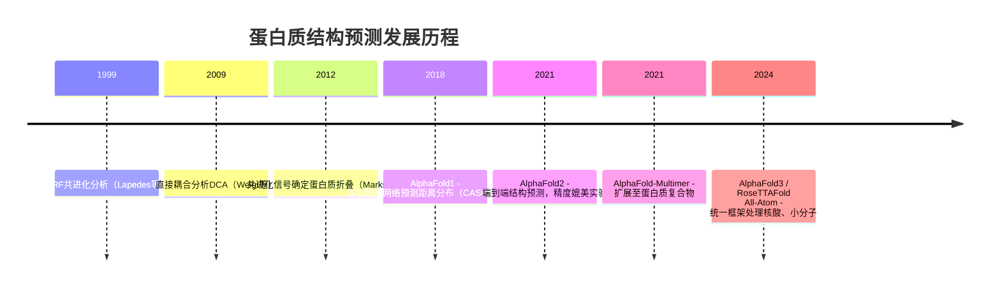
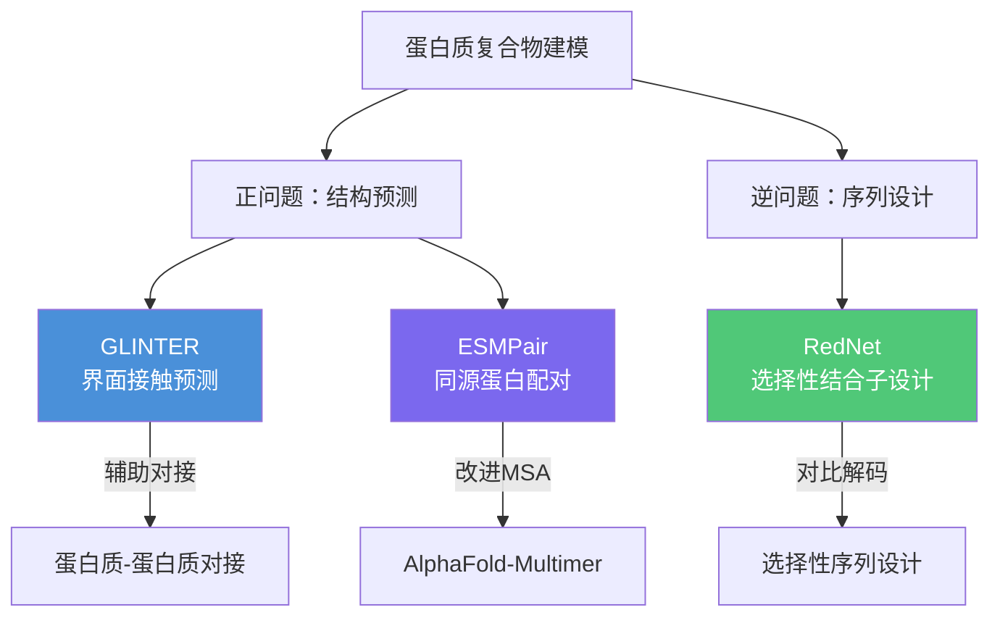
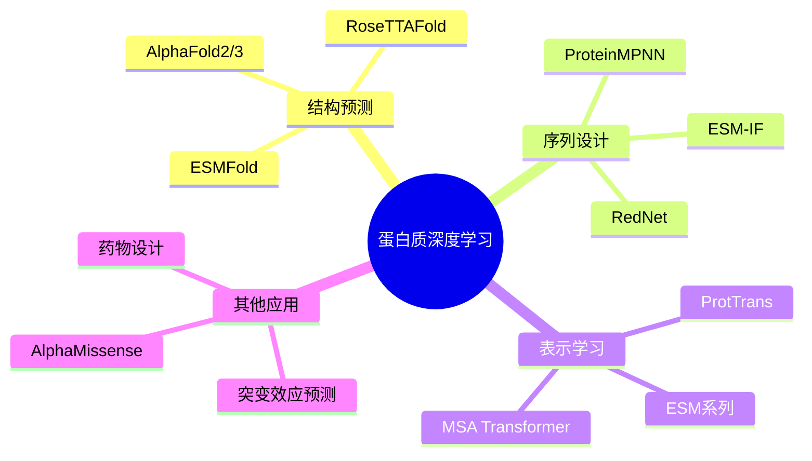

# 00 | 研究背景与总体概览

## 研究动机

蛋白质通过折叠成三维结构并与其他分子相互作用来执行生物功能。蛋白质-蛋白质相互作用构成了细胞机器的基础，精确建模和设计蛋白质复合物对于理解细胞功能、开发治疗药物具有重要意义。

### 实验方法的局限性

| 实验方法 | 优势 | 局限 |
|---------|------|------|
| X射线晶体学 | 原子级分辨率，金标准 | 结晶困难，耗时耗力 |
| Cryo-EM | 无需结晶，适合大复合物 | 小蛋白（<50 kDa）困难，<2Å分辨率难 |
| NMR | 溶液中动态信息 | 蛋白质>40 kDa困难 |
| 定向进化 | 强大的工程工具 | 需要起始模板，筛选空间有限（~10⁸–10¹³） |

### 计算方法的崛起

---

## 三大核心贡献

### 方法间的逻辑关联

三个方法共享同一核心哲学：**领域特化的深度学习架构 + 原则性搜索策略**

- **GLINTER** 建立了多尺度图神经网络处理蛋白质结构的基础框架
- **ESMPair** 解决了GLINTER依赖的共进化信号质量问题（同源蛋白配对）
- **RedNet** 将GLINTER的图神经网络方法扩展至序列设计，并引入对比解码实现选择性

---

## 深度学习在蛋白质建模中的应用版图

---

## 论文结构

| 章节 | 内容 | 对应方法 |
|------|------|---------|
| Chapter 1 | 引言：蛋白质结构预测与设计综述 | — |
| Chapter 2 | 图学习蛋白质界面接触 | GLINTER |
| Chapter 3 | 蛋白质语言模型改进异源二聚体预测 | ESMPair |
| Chapter 4 | 对比解码重设计选择性蛋白质结合子 | RedNet |
| Chapter 5 | 总结与未来方向 | — |
