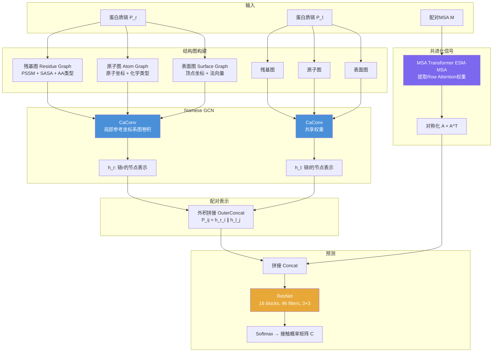
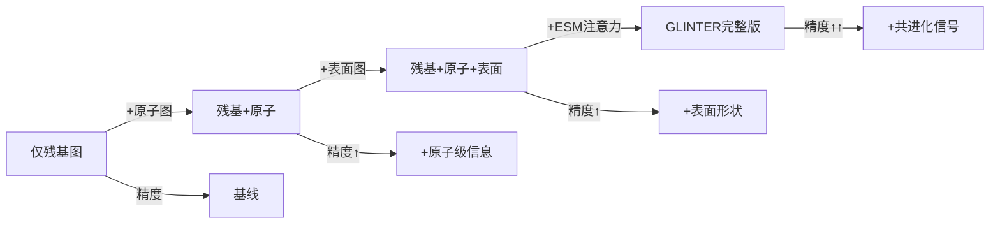

# 01 | GLINTER：图学习蛋白质界面接触预测

> **发表**：*Bioinformatics*, 2022
> **代码**：https://github.com/zw2x/glinter
> **合作者**：Jinbo Xu

---

## 问题定义

**界面接触预测（Interfacial Contact Prediction）**：给定两条蛋白质链（及其结构），预测哪些残基对会在蛋白质-蛋白质界面上发生接触（通常定义为Cβ-Cβ距离 < 8Å）。

### 为什么困难？

- 异源二聚体的共进化分析需要大量相互作用的同源蛋白（interolog），但很多异源二聚体难以找到足够数量
- 蛋白质界面接触密度极低（训练集中位数仅0.76%），严重类别不平衡
- 需要同时利用结构信息和序列共进化信号

---

## GLINTER 架构



---

## 核心模块详解

### 1. CaConv：局部参考坐标系图卷积

**关键思想**：在计算节点 q 的消息时，将其所有邻居节点先以 q 为原点平移，再用 q 的预定义局部参考坐标系旋转，实现旋转不变性。

```
g(q) = g(max_pool([x_q, x_v, e(q,v)]))  for v in N(q)
```

- 局部参考坐标系由 Cα 坐标定义
- 标准化后的特征与其他特征拼接作为子网络输入
- 多个图（残基/原子/表面）的GCN输出拼接为单一向量

### 2. 多尺度图表示

| 图类型 | 节点 | 关键特征 | 捕获信息 |
|--------|------|---------|---------|
| 残基图 | 每个残基 | PSSM(20维) + SASA + AA类型 + Cα坐标 + 局部参考系 | 序列保守性、溶剂可及性 |
| 原子图 | 每个重原子 | 原子类型(10维) + 坐标 + 边类型 | 侧链几何、原子级相互作用 |
| 表面图 | 表面三角顶点 | 坐标 + 法向量 | 表面形状互补性 |

### 3. MSA Transformer 共进化信号

- 使用 Facebook ESM-MSA-1b 的 **Row Attention** 权重（144个注意力头）
- 对跨链注意力矩阵进行对称化：`A = A[:Nr, Nr:] + A[Nr:, :Nr]^T`
- 直接将注意力权重作为共进化特征，无需显式计算耦合参数

---

## 数据集

| 数据集 | 描述 | 规模 |
|--------|------|------|
| CASP-CAPRI | 第13、14届CASP-CAPRI，≤1000残基 | 32个二聚体（23同源+9异源） |
| HomoPDB2018 | 2018年后发布的同源二聚体 | 165个 |
| HeteroPDB2018 | 2018年后发布的异源二聚体 | 72个 |

**训练细节**：
- 损失函数：加权交叉熵（权重5/10/50/100，应对类别不平衡）
- 评估指标：Top-k精度（k = 10, 25, 50, L/10, L/5）

---

## 实验结果

### 主要结果（Top-10精度，%）

| 方法 | HomoCASP | HeteroCASP | HomoPDB | HeteroPDB |
|------|---------|-----------|---------|-----------|
| BIPSPI | 16 | 11 | 20 | 18 |
| DeepHomo | 30 | — | 24 | — |
| ComplexContact | — | 14 | — | 14 |
| **GLINTER** | **54** | **44** | **48** | **47** |
| GLINTER* (AF结构) | 43 | 24 | — | — |

> *GLINTER* 使用AlphaFold预测结构，其余使用实验结构

### 消融实验关键发现



- ESM注意力权重的加入带来最显著的性能提升
- 结构信息（原子+表面）与共进化信号互补，缺一不可
- 预测结构（AlphaFold）与实验结构的性能差距随TMscore提高而缩小（R²=0.31）

### 对接诱饵筛选应用

使用Top-10/25/50预测接触来筛选HDOCK生成的对接诱饵：
- 预测接触可有效提升所选诱饵的平均TMscore
- 使用更多预测接触（Top-50）通常优于更少（Top-10）

---

## 方法对比

| 方法 | 结构输入 | 序列输入 | 适用范围 |
|------|---------|---------|---------|
| ComplexContact | ✗ | MSA（CCMpred） | 异源二聚体 |
| DeepHomo | ✗ | MSA（CCMpred） | 同源二聚体 |
| BIPSPI | ✓ | MSA | 两者 |
| **GLINTER** | ✓（多尺度） | MSA Transformer | 两者 |

---

## 关键洞察

1. **结构 + 共进化的互补性**：单独使用结构图或ESM注意力均不如两者结合，说明两种信息源捕获了不同的界面特征
2. **局部参考坐标系的重要性**：CaConv的旋转不变性设计使模型对蛋白质朝向不敏感
3. **MSA深度的影响**：ESM注意力模型的性能与 ln(Meff) 正相关（R²=0.31），MSA越深效果越好
4. **预测结构的可用性**：使用AlphaFold预测结构时性能下降有限，说明GLINTER在实际应用中具有可行性


---

## Python 伪代码实现

```python
import torch
import torch.nn as nn
import torch.nn.functional as F

# ─────────────────────────────────────────────
# 1. 局部参考坐标系图卷积 CaConv
# ─────────────────────────────────────────────
class CaConv(nn.Module):
    """
    基于 Cα 局部参考坐标系的图卷积层。
    对每个节点 q，将其邻居坐标变换到 q 的局部坐标系后再聚合，
    实现旋转不变性。
    """
    def __init__(self, node_dim, edge_dim, hidden_dim):
        super().__init__()
        # 边消息网络：输入 = [节点i特征, 节点j特征, 边特征]
        self.edge_mlp = nn.Sequential(
            nn.Linear(2 * node_dim + edge_dim, hidden_dim),
            nn.ReLU(),
            nn.Linear(hidden_dim, hidden_dim),
        )
        # 节点更新网络：输入 = [节点特征, 聚合消息]
        self.node_mlp = nn.Sequential(
            nn.Linear(node_dim + hidden_dim, hidden_dim),
            nn.ReLU(),
            nn.Linear(hidden_dim, node_dim),
        )

    def forward(self, x, edge_index, edge_feat, pos, local_frames):
        """
        x           : [N, node_dim]  节点特征
        edge_index  : [2, E]         边索引 (src, dst)
        edge_feat   : [E, edge_dim]  边特征
        pos         : [N, 3]         Cα 坐标
        local_frames: [N, 3, 3]      每个节点的局部参考坐标系（旋转矩阵）
        """
        src, dst = edge_index  # src → dst

        # 将邻居坐标变换到目标节点的局部坐标系
        rel_pos = pos[src] - pos[dst]                        # [E, 3]
        local_rel = torch.einsum(
            'eij,ej->ei', local_frames[dst], rel_pos         # [E, 3]
        )

        # 构建边消息（拼接局部相对坐标到边特征）
        edge_input = torch.cat([
            x[src], x[dst],
            edge_feat,
            local_rel                                         # 注入几何信息
        ], dim=-1)
        messages = self.edge_mlp(edge_input)                  # [E, hidden_dim]

        # Max-pooling 聚合邻居消息
        agg = torch.zeros(x.size(0), messages.size(-1),
                          device=x.device)
        agg.scatter_reduce_(0, dst.unsqueeze(-1).expand_as(messages),
                            messages, reduce='amax')           # [N, hidden_dim]

        # 节点更新
        node_input = torch.cat([x, agg], dim=-1)
        x_new = self.node_mlp(node_input)                     # [N, node_dim]
        return x_new


# ─────────────────────────────────────────────
# 2. 多尺度图编码器（Siamese GCN）
# ─────────────────────────────────────────────
class MultiScaleGCN(nn.Module):
    """
    对残基图、原子图、表面图分别用 CaConv 编码，
    输出拼接为单一节点表示向量。
    两条链共享权重（Siamese 结构）。
    """
    def __init__(self, residue_dim, atom_dim, surface_dim, out_dim, num_layers=3):
        super().__init__()
        self.residue_gcn = nn.ModuleList(
            [CaConv(residue_dim, 16, 128) for _ in range(num_layers)]
        )
        self.atom_gcn = nn.ModuleList(
            [CaConv(atom_dim, 8, 128) for _ in range(num_layers)]
        )
        self.surface_gcn = nn.ModuleList(
            [CaConv(surface_dim, 6, 64) for _ in range(num_layers)]
        )
        # 将三种图的输出映射到统一维度
        self.proj = nn.Linear(128 + 128 + 64, out_dim)

    def forward(self, residue_graph, atom_graph, surface_graph):
        # 分别在三种图上做多层图卷积
        h_res = residue_graph.x
        for layer in self.residue_gcn:
            h_res = layer(h_res, residue_graph.edge_index,
                          residue_graph.edge_attr,
                          residue_graph.pos, residue_graph.frames)

        h_atom = atom_graph.x
        for layer in self.atom_gcn:
            h_atom = layer(h_atom, atom_graph.edge_index,
                           atom_graph.edge_attr,
                           atom_graph.pos, atom_graph.frames)

        h_surf = surface_graph.x
        for layer in self.surface_gcn:
            h_surf = layer(h_surf, surface_graph.edge_index,
                           surface_graph.edge_attr,
                           surface_graph.pos, surface_graph.frames)

        # 将原子/表面特征池化到残基级别，再拼接
        h_atom_res = scatter_mean(h_atom, atom_graph.residue_id, dim=0)
        h_surf_res = scatter_mean(h_surf, surface_graph.residue_id, dim=0)

        h = torch.cat([h_res, h_atom_res, h_surf_res], dim=-1)
        return self.proj(h)  # [N_residues, out_dim]


# ─────────────────────────────────────────────
# 3. GLINTER 主模型
# ─────────────────────────────────────────────
class GLINTER(nn.Module):
    """
    完整 GLINTER 模型：
      结构图 GCN → 外积配对表示
      + MSA Transformer 注意力权重
      → ResNet → 接触概率矩阵
    """
    def __init__(self, node_dim=128, esm_heads=144, resnet_filters=96):
        super().__init__()
        self.gcn = MultiScaleGCN(
            residue_dim=43,   # PSSM(20) + SASA(1) + AA(21) + pos(1)
            atom_dim=32,
            surface_dim=6,
            out_dim=node_dim
        )
        # 接触预测 ResNet（输入 = 配对表示 + ESM 注意力）
        pair_dim = 2 * node_dim + esm_heads
        self.resnet = ContactResNet(
            in_channels=pair_dim,
            num_filters=resnet_filters,
            num_blocks=16
        )
        self.output_head = nn.Linear(resnet_filters, 2)  # 接触 / 非接触

    def forward(self, chain_r, chain_l, paired_msa, esm_model):
        """
        chain_r, chain_l : 两条蛋白质链的多尺度图数据
        paired_msa       : 配对 MSA（用于 ESM-MSA-1b）
        esm_model        : 预训练 ESM-MSA-1b 模型（冻结）
        """
        # Step 1: 两条链分别编码（共享权重）
        h_r = self.gcn(*chain_r.graphs)   # [L1, node_dim]
        h_l = self.gcn(*chain_l.graphs)   # [L2, node_dim]

        # Step 2: 外积拼接 → 配对表示
        # P[i,j] = [h_r[i] || h_l[j]]
        P = torch.cat([
            h_r.unsqueeze(1).expand(-1, h_l.size(0), -1),   # [L1, L2, node_dim]
            h_l.unsqueeze(0).expand(h_r.size(0), -1, -1),   # [L1, L2, node_dim]
        ], dim=-1)  # [L1, L2, 2*node_dim]

        # Step 3: 提取 ESM-MSA-1b Row Attention 权重
        with torch.no_grad():
            esm_out = esm_model(paired_msa, repr_layers=[], return_contacts=False)
            # row_attn: [num_layers, num_heads, L_total, L_total]
            row_attn = esm_out["row_attentions"]

        # 取跨链部分并对称化
        L1, L2 = h_r.size(0), h_l.size(0)
        A = row_attn[:, :, :L1, L1:]          # [layers, heads, L1, L2]
        A_sym = A + row_attn[:, :, L1:, :L1].transpose(-1, -2)
        # 展平 layers×heads 维度 → [L1, L2, 144]
        A_flat = A_sym.permute(2, 3, 0, 1).reshape(L1, L2, -1)

        # Step 4: 拼接配对表示与 ESM 注意力
        Z = torch.cat([P, A_flat], dim=-1)    # [L1, L2, 2*node_dim + 144]

        # Step 5: ResNet 预测接触概率
        Z = Z.permute(2, 0, 1).unsqueeze(0)  # [1, C, L1, L2]
        logits = self.resnet(Z)               # [1, 2, L1, L2]
        contact_prob = F.softmax(logits, dim=1)[:, 1]  # [1, L1, L2]
        return contact_prob


class ContactResNet(nn.Module):
    """16 层残差卷积网络，用于从配对特征预测接触概率。"""
    def __init__(self, in_channels, num_filters=96, num_blocks=16):
        super().__init__()
        self.input_proj = nn.Conv2d(in_channels, num_filters, 1)
        self.blocks = nn.ModuleList([
            ResBlock2D(num_filters) for _ in range(num_blocks)
        ])
        self.output_conv = nn.Conv2d(num_filters, 2, 1)

    def forward(self, x):
        x = self.input_proj(x)
        for block in self.blocks:
            x = block(x)
        return self.output_conv(x)


class ResBlock2D(nn.Module):
    def __init__(self, channels):
        super().__init__()
        self.net = nn.Sequential(
            nn.Conv2d(channels, channels, 3, padding=1),
            nn.InstanceNorm2d(channels),
            nn.ReLU(),
            nn.Conv2d(channels, channels, 3, padding=1),
            nn.InstanceNorm2d(channels),
        )

    def forward(self, x):
        return F.relu(x + self.net(x))


# ─────────────────────────────────────────────
# 4. 训练循环（简化版）
# ─────────────────────────────────────────────
def train_glinter(model, dataloader, optimizer, pos_weight=50.0):
    """
    加权二元交叉熵损失，应对界面接触极度稀疏（密度~0.76%）的问题。
    """
    model.train()
    criterion = nn.CrossEntropyLoss(
        weight=torch.tensor([1.0, pos_weight])  # 正样本权重
    )
    for batch in dataloader:
        contact_prob = model(
            batch.chain_r, batch.chain_l,
            batch.paired_msa, batch.esm_model
        )
        loss = criterion(contact_prob, batch.labels)
        optimizer.zero_grad()
        loss.backward()
        optimizer.step()
```
