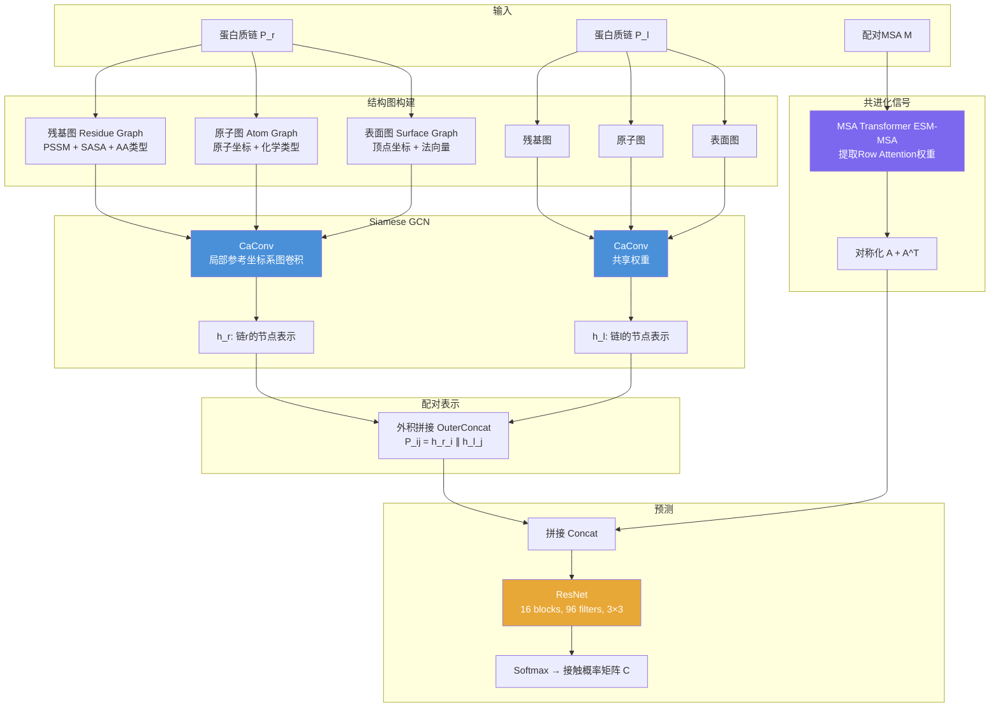
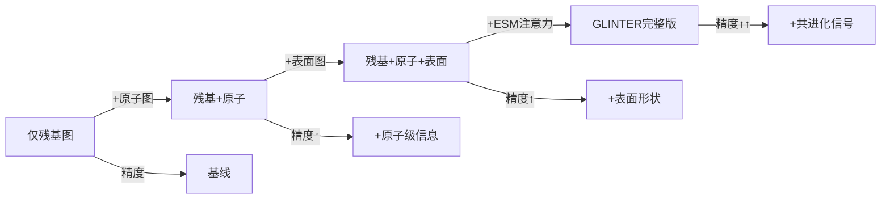

# 01 | GLINTER：图学习蛋白质界面接触预测

> **发表**：*Bioinformatics*, 2022
> **代码**：https://github.com/zw2x/glinter
> **合作者**：Jinbo Xu

---

## 问题定义

**界面接触预测（Interfacial Contact Prediction）**：给定两条蛋白质链（及其结构），预测哪些残基对会在蛋白质-蛋白质界面上发生接触（通常定义为Cβ-Cβ距离 < 8Å）。

### 为什么困难？

- 异源二聚体的共进化分析需要大量相互作用的同源蛋白（interolog），但很多异源二聚体难以找到足够数量
- 蛋白质界面接触密度极低（训练集中位数仅0.76%），严重类别不平衡
- 需要同时利用结构信息和序列共进化信号

---

## GLINTER 架构



---

## 核心模块详解

### 1. CaConv：局部参考坐标系图卷积

**关键思想**：在计算节点 q 的消息时，将其所有邻居节点先以 q 为原点平移，再用 q 的预定义局部参考坐标系旋转，实现旋转不变性。

```
g(q) = g(max_pool([x_q, x_v, e(q,v)]))  for v in N(q)
```

- 局部参考坐标系由 Cα 坐标定义
- 标准化后的特征与其他特征拼接作为子网络输入
- 多个图（残基/原子/表面）的GCN输出拼接为单一向量

### 2. 多尺度图表示

| 图类型 | 节点 | 关键特征 | 捕获信息 |
|--------|------|---------|---------|
| 残基图 | 每个残基 | PSSM(20维) + SASA + AA类型 + Cα坐标 + 局部参考系 | 序列保守性、溶剂可及性 |
| 原子图 | 每个重原子 | 原子类型(10维) + 坐标 + 边类型 | 侧链几何、原子级相互作用 |
| 表面图 | 表面三角顶点 | 坐标 + 法向量 | 表面形状互补性 |

### 3. MSA Transformer 共进化信号

- 使用 Facebook ESM-MSA-1b 的 **Row Attention** 权重（144个注意力头）
- 对跨链注意力矩阵进行对称化：`A = A[:Nr, Nr:] + A[Nr:, :Nr]^T`
- 直接将注意力权重作为共进化特征，无需显式计算耦合参数

---

## 数据集

| 数据集 | 描述 | 规模 |
|--------|------|------|
| CASP-CAPRI | 第13、14届CASP-CAPRI，≤1000残基 | 32个二聚体（23同源+9异源） |
| HomoPDB2018 | 2018年后发布的同源二聚体 | 165个 |
| HeteroPDB2018 | 2018年后发布的异源二聚体 | 72个 |

**训练细节**：
- 损失函数：加权交叉熵（权重5/10/50/100，应对类别不平衡）
- 评估指标：Top-k精度（k = 10, 25, 50, L/10, L/5）

---

## 实验结果

### 主要结果（Top-10精度，%）

| 方法 | HomoCASP | HeteroCASP | HomoPDB | HeteroPDB |
|------|---------|-----------|---------|-----------|
| BIPSPI | 16 | 11 | 20 | 18 |
| DeepHomo | 30 | — | 24 | — |
| ComplexContact | — | 14 | — | 14 |
| **GLINTER** | **54** | **44** | **48** | **47** |
| GLINTER* (AF结构) | 43 | 24 | — | — |

> *GLINTER* 使用AlphaFold预测结构，其余使用实验结构

### 消融实验关键发现



- ESM注意力权重的加入带来最显著的性能提升
- 结构信息（原子+表面）与共进化信号互补，缺一不可
- 预测结构（AlphaFold）与实验结构的性能差距随TMscore提高而缩小（R²=0.31）

### 对接诱饵筛选应用

使用Top-10/25/50预测接触来筛选HDOCK生成的对接诱饵：
- 预测接触可有效提升所选诱饵的平均TMscore
- 使用更多预测接触（Top-50）通常优于更少（Top-10）

---

## 方法对比

| 方法 | 结构输入 | 序列输入 | 适用范围 |
|------|---------|---------|---------|
| ComplexContact | ✗ | MSA（CCMpred） | 异源二聚体 |
| DeepHomo | ✗ | MSA（CCMpred） | 同源二聚体 |
| BIPSPI | ✓ | MSA | 两者 |
| **GLINTER** | ✓（多尺度） | MSA Transformer | 两者 |

---

## 关键洞察

1. **结构 + 共进化的互补性**：单独使用结构图或ESM注意力均不如两者结合，说明两种信息源捕获了不同的界面特征
2. **局部参考坐标系的重要性**：CaConv的旋转不变性设计使模型对蛋白质朝向不敏感
3. **MSA深度的影响**：ESM注意力模型的性能与 ln(Meff) 正相关（R²=0.31），MSA越深效果越好
4. **预测结构的可用性**：使用AlphaFold预测结构时性能下降有限，说明GLINTER在实际应用中具有可行性
