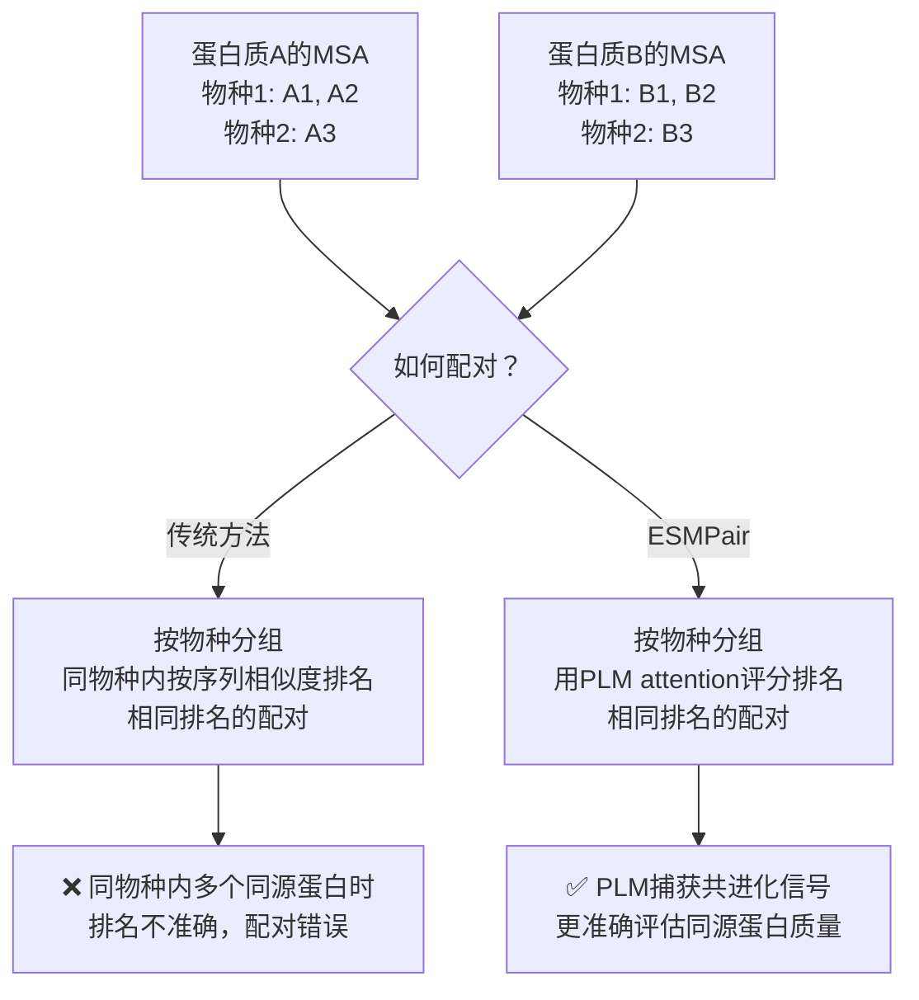
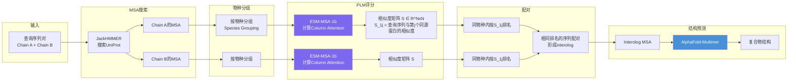
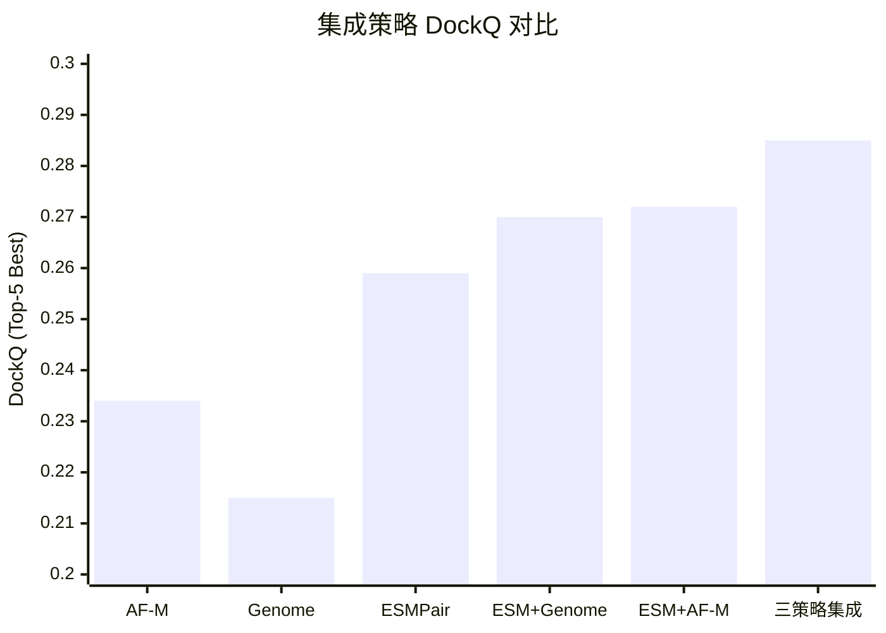
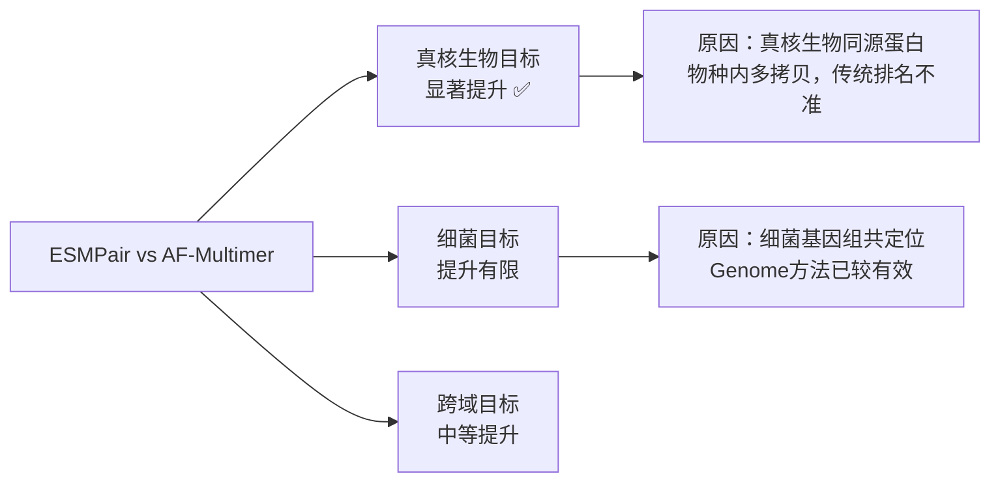
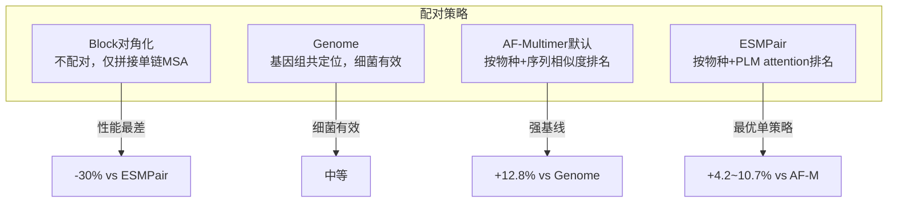

# 02 | ESMPair：蛋白质语言模型改进异源二聚体结构预测

> **发表**：*Briefings in Bioinformatics*, 2023
> **代码**：https://github.com/zw2x/msa_pair
> **合作者**：Bo Chen, Jiezhong Qiu, Zhaofeng Ye, Jinbo Xu, Jie Tang

---

## 问题定义

**同源蛋白配对（Interolog Pairing）**：AlphaFold-Multimer预测蛋白质复合物结构的核心输入是**相互作用同源蛋白的MSA（interolog MSA）**。构建高质量interolog MSA的关键在于：在不同物种中，正确识别并配对真正相互作用的同源蛋白。

### 为什么配对困难？

---

## ESMPair 方法

### 整体流程

### Column Attention 评分公式

ESM-MSA-1b 的 column attention 权重矩阵 $A_{lhc} \in \mathbb{R}^{N \times N}$（L层，H头，C列）：

$$S = \text{AGG}\left(A_{lhc} + A_{lhc}^\top\right), \quad l \in [L], h \in [H], c \in [C]$$

- 对每个注意力矩阵进行对称化
- 沿层、头、列维度聚合（默认求和）
- $S_{1j}$ 衡量查询序列与第 $j$ 个同源蛋白的相似度

**直觉**：PLM的column attention隐式编码了序列间的共进化关系，高attention score的同源蛋白更可能是真正的相互作用伙伴。

---

## 数据集与评估

### 测试集定义

| 测试集 | 筛选标准 | 规模 |
|--------|---------|------|
| **pConf70** | pConf < 0.7（低置信度，困难目标） | 主要测试集 |
| **pConf80** | pConf < 0.8 | 中等难度 |
| **DockQ49** | DockQ < 0.49（AF-Multimer预测质量低） | 困难目标 |

> pConf = AlphaFold-Multimer的预测置信度；低pConf意味着AF-M自身预测不确定，是改进空间最大的目标

### 评估指标

- **DockQ**：综合评估对接质量（0-1，≥0.23为可接受）
- **TMscore**：全局结构相似性
- **ICS/IPS**：界面接触/界面补丁得分
- **成功率（SR）**：DockQ ≥ 0.23 的比例

---

## 实验结果

### 主要结果

| 方法 | pConf70 Top-5 DockQ | pConf70 SR | DockQ49 Top-5 | pConf80 Top-5 |
|------|-------------------|-----------|--------------|--------------|
| Block对角化 | 0.199 | 30.4% | 0.212 | 0.351 |
| Genome（基因组共定位） | 0.215 | 33.7% | 0.219 | 0.377 |
| AF-Multimer（默认） | 0.234 | 42.4% | 0.247 | 0.408 |
| **ESMPair** | **0.259** | **42.4%** | **0.265** | **0.423** |

### 集成策略结果（pConf70）

| 策略 | DockQ | 成功率 |
|------|-------|--------|
| ESMPair（单策略最优） | 0.259 | 42.4% |
| ESMPair + Genome | 0.277 | 44.6% |
| **三策略集成** | **0.285** | **46.8%** |

### 分域分析

### 影响预测精度的因素

| 因素 | 与DockQ的相关性 | 说明 |
|------|--------------|------|
| Column Attention Score | 负相关（r ≈ -0.70） | 高分→MSA多样性低→预测难 |
| Meff（有效序列数） | 正相关 | MSA越深越好 |
| 物种数量 | 正相关 | 物种多样性有助于配对 |
| 配对MSA深度 | 正相关 | 配对后MSA越深越好 |

---

## 与基线方法对比

---

## 计算开销

- 主要开销来自 ESM-MSA-1b 推理
- 单张 V100（32GB）：512条序列（最长1024残基）仅需数秒
- 相比之下，JackHMMER MSA搜索和AF-M预测是主要时间瓶颈
- ESMPair的额外开销在整体流程中占比很小

---

## 关键洞察

1. **PLM attention作为同源蛋白质量代理**：ESM-MSA-1b的column attention隐式编码了序列间的功能相关性，无需显式训练即可用于配对质量评估
2. **低pConf目标改进最大**：ESMPair对AF-M置信度低的目标提升最显著，说明在困难情况下正确配对更关键
3. **集成的价值**：三种策略（ESMPair/Genome/AF-M）捕获互补信息，集成后性能进一步提升
4. **ColAttn与Meff的负相关**：高attention score往往对应低Meff（序列多样性低），揭示了PLM评分的内在机制
