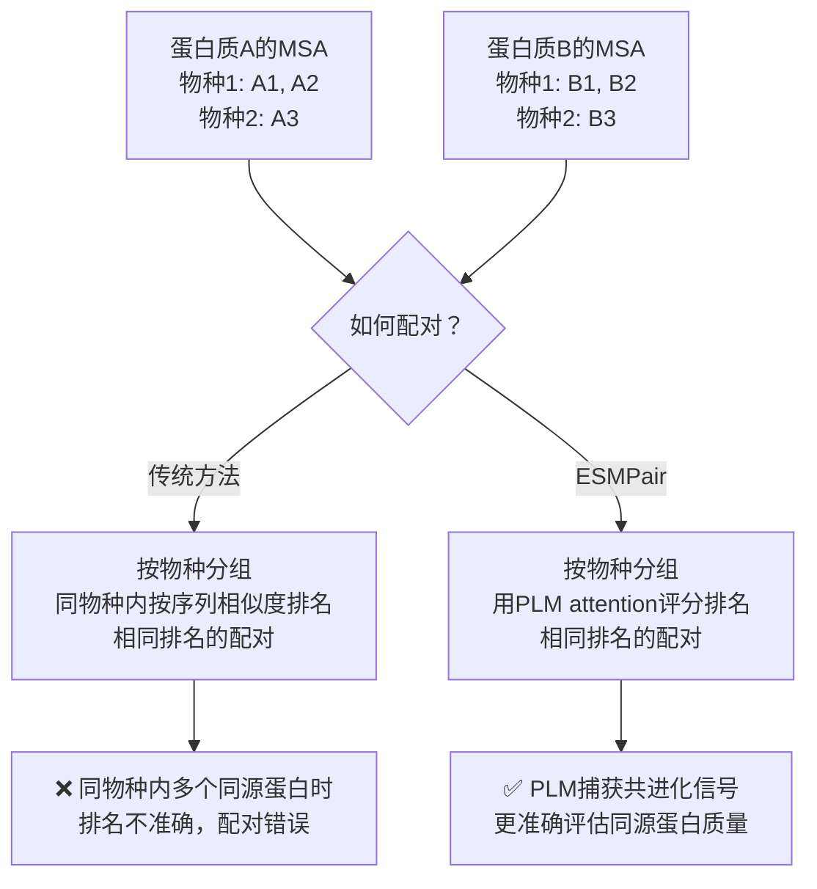
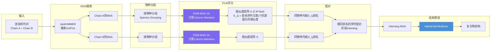
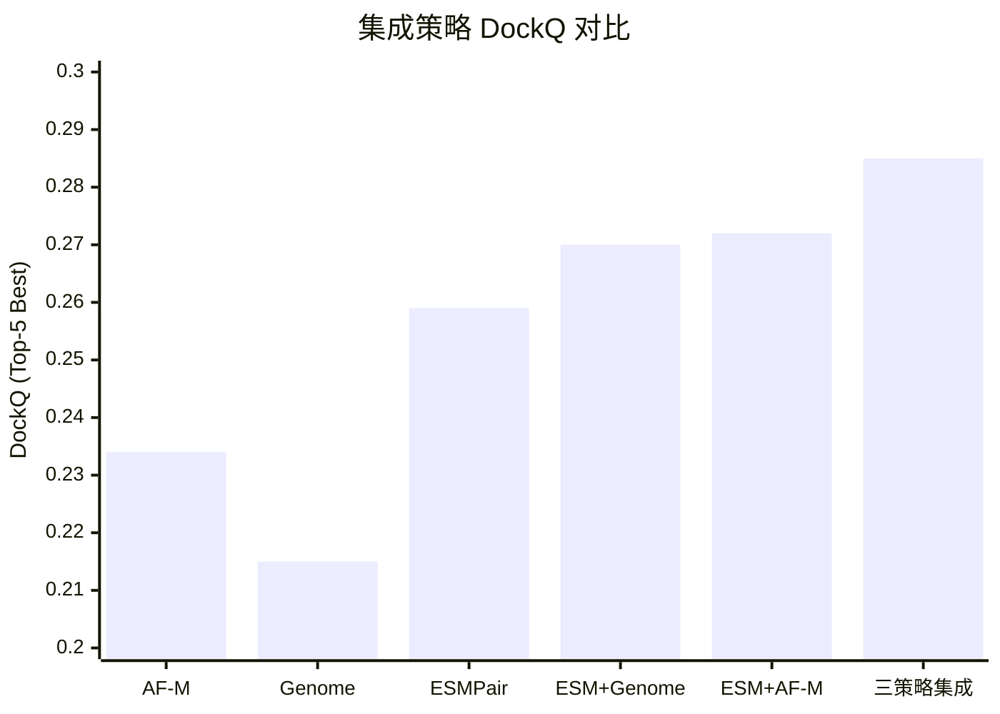
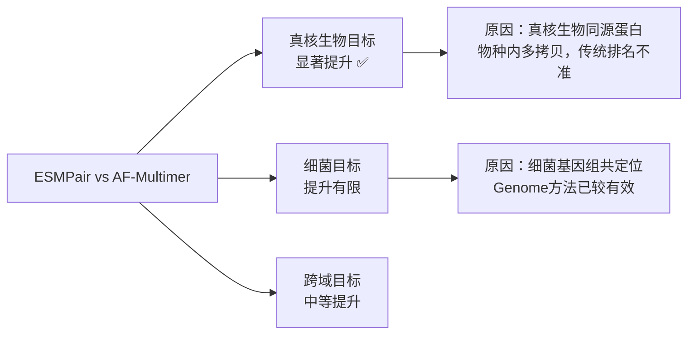
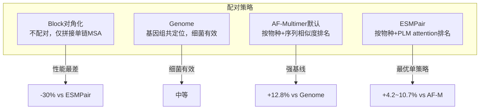

# 02 | ESMPair：蛋白质语言模型改进异源二聚体结构预测

> **发表**：*Briefings in Bioinformatics*, 2023
> **代码**：https://github.com/zw2x/msa_pair
> **合作者**：Bo Chen, Jiezhong Qiu, Zhaofeng Ye, Jinbo Xu, Jie Tang

---

## 问题定义

**同源蛋白配对（Interolog Pairing）**：AlphaFold-Multimer预测蛋白质复合物结构的核心输入是**相互作用同源蛋白的MSA（interolog MSA）**。构建高质量interolog MSA的关键在于：在不同物种中，正确识别并配对真正相互作用的同源蛋白。

### 为什么配对困难？



---

## ESMPair 方法

### 整体流程



### Column Attention 评分公式

ESM-MSA-1b 的 column attention 权重矩阵 $A_{lhc} \in \mathbb{R}^{N \times N}$（L层，H头，C列）：

$$S = \text{AGG}\left(A_{lhc} + A_{lhc}^\top\right), \quad l \in [L], h \in [H], c \in [C]$$

- 对每个注意力矩阵进行对称化
- 沿层、头、列维度聚合（默认求和）
- $S_{1j}$ 衡量查询序列与第 $j$ 个同源蛋白的相似度

**直觉**：PLM的column attention隐式编码了序列间的共进化关系，高attention score的同源蛋白更可能是真正的相互作用伙伴。

---

## 数据集与评估

### 测试集定义

| 测试集 | 筛选标准 | 规模 |
|--------|---------|------|
| **pConf70** | pConf < 0.7（低置信度，困难目标） | 主要测试集 |
| **pConf80** | pConf < 0.8 | 中等难度 |
| **DockQ49** | DockQ < 0.49（AF-Multimer预测质量低） | 困难目标 |

> pConf = AlphaFold-Multimer的预测置信度；低pConf意味着AF-M自身预测不确定，是改进空间最大的目标

### 评估指标

- **DockQ**：综合评估对接质量（0-1，≥0.23为可接受）
- **TMscore**：全局结构相似性
- **ICS/IPS**：界面接触/界面补丁得分
- **成功率（SR）**：DockQ ≥ 0.23 的比例

---

## 实验结果

### 主要结果

| 方法 | pConf70 Top-5 DockQ | pConf70 SR | DockQ49 Top-5 | pConf80 Top-5 |
|------|-------------------|-----------|--------------|--------------|
| Block对角化 | 0.199 | 30.4% | 0.212 | 0.351 |
| Genome（基因组共定位） | 0.215 | 33.7% | 0.219 | 0.377 |
| AF-Multimer（默认） | 0.234 | 42.4% | 0.247 | 0.408 |
| **ESMPair** | **0.259** | **42.4%** | **0.265** | **0.423** |

### 集成策略结果（pConf70）



| 策略 | DockQ | 成功率 |
|------|-------|--------|
| ESMPair（单策略最优） | 0.259 | 42.4% |
| ESMPair + Genome | 0.277 | 44.6% |
| **三策略集成** | **0.285** | **46.8%** |

### 分域分析



### 影响预测精度的因素

| 因素 | 与DockQ的相关性 | 说明 |
|------|--------------|------|
| Column Attention Score | 负相关（r ≈ -0.70） | 高分→MSA多样性低→预测难 |
| Meff（有效序列数） | 正相关 | MSA越深越好 |
| 物种数量 | 正相关 | 物种多样性有助于配对 |
| 配对MSA深度 | 正相关 | 配对后MSA越深越好 |

---

## 与基线方法对比



---

## 计算开销

- 主要开销来自 ESM-MSA-1b 推理
- 单张 V100（32GB）：512条序列（最长1024残基）仅需数秒
- 相比之下，JackHMMER MSA搜索和AF-M预测是主要时间瓶颈
- ESMPair的额外开销在整体流程中占比很小

---

## 关键洞察

1. **PLM attention作为同源蛋白质量代理**：ESM-MSA-1b的column attention隐式编码了序列间的功能相关性，无需显式训练即可用于配对质量评估
2. **低pConf目标改进最大**：ESMPair对AF-M置信度低的目标提升最显著，说明在困难情况下正确配对更关键
3. **集成的价值**：三种策略（ESMPair/Genome/AF-M）捕获互补信息，集成后性能进一步提升
4. **ColAttn与Meff的负相关**：高attention score往往对应低Meff（序列多样性低），揭示了PLM评分的内在机制


---

## Python 伪代码实现

```python
import torch
import numpy as np
from collections import defaultdict

# ─────────────────────────────────────────────
# 1. Column Attention 评分计算
# ─────────────────────────────────────────────
def compute_column_attention_scores(msa_sequences, esm_msa_model):
    """
    用 ESM-MSA-1b 计算 MSA 中每条序列相对于查询序列的相似度分数。

    msa_sequences : List[str]，第一条为查询序列，其余为同源蛋白
    esm_msa_model : 预训练 ESM-MSA-1b 模型（冻结）

    返回：
        scores : np.ndarray [N]，scores[j] = 查询序列与第 j 条序列的相似度
    """
    # Tokenize MSA
    tokens = esm_msa_model.alphabet.get_batch_converter()(
        [("seq", s) for s in msa_sequences]
    )[2]  # [1, N, L]

    with torch.no_grad():
        output = esm_msa_model(tokens, repr_layers=[], return_contacts=False)
        # col_attentions: [1, num_layers, num_heads, N, N]
        col_attentions = output["col_attentions"]

    # 对称化每个注意力矩阵，然后沿 layers × heads × columns 求和
    # A_lhc: [N, N]，对称化后 S = sum over l,h,c
    A = col_attentions[0]                          # [L, H, N, N]
    A_sym = A + A.transpose(-1, -2)                # 对称化
    S = A_sym.sum(dim=(0, 1))                      # [N, N]，沿 layers 和 heads 求和

    # S[0, j] = 查询序列（第0行）与第 j 条序列的相似度
    scores = S[0].cpu().numpy()                    # [N]
    return scores


# ─────────────────────────────────────────────
# 2. 物种分组与排名
# ─────────────────────────────────────────────
def group_and_rank_by_species(msa_sequences, species_labels, scores):
    """
    将 MSA 中的同源蛋白按物种分组，组内按 column attention score 降序排名。

    msa_sequences  : List[str]，MSA 序列（第0条为查询）
    species_labels : List[str]，每条序列对应的物种标签
    scores         : np.ndarray [N]，column attention 相似度分数

    返回：
        ranked_by_species : Dict[species -> List[seq_idx]]
                            每个物种内按分数降序排列的序列索引
    """
    species_groups = defaultdict(list)
    for idx, (seq, species) in enumerate(zip(msa_sequences, species_labels)):
        if idx == 0:
            continue  # 跳过查询序列本身
        species_groups[species].append(idx)

    ranked_by_species = {}
    for species, indices in species_groups.items():
        # 按 column attention score 降序排列
        sorted_indices = sorted(indices, key=lambda i: scores[i], reverse=True)
        ranked_by_species[species] = sorted_indices

    return ranked_by_species


# ─────────────────────────────────────────────
# 3. ESMPair 核心配对算法
# ─────────────────────────────────────────────
def esmpair(
    query_chain_A: str,
    query_chain_B: str,
    esm_msa_model,
    jackhmmer_search_fn,
    min_pairs: int = 100
):
    """
    ESMPair 主流程：给定两条查询序列，返回配对好的 interolog MSA。

    query_chain_A  : 链 A 的查询序列
    query_chain_B  : 链 B 的查询序列
    esm_msa_model  : 预训练 ESM-MSA-1b（冻结）
    jackhmmer_search_fn : 调用 JackHMMER 搜索 UniProt 的函数
    min_pairs      : 最少配对数量阈值

    返回：
        interolog_msa : List[Tuple[str, str]]，配对后的 (chainA_seq, chainB_seq) 列表
    """
    # Step 1: 分别搜索两条链的 MSA
    msa_A, species_A = jackhmmer_search_fn(query_chain_A)  # List[seq], List[species]
    msa_B, species_B = jackhmmer_search_fn(query_chain_B)

    # Step 2: 用 ESM-MSA-1b 计算 column attention 评分
    scores_A = compute_column_attention_scores(msa_A, esm_msa_model)
    scores_B = compute_column_attention_scores(msa_B, esm_msa_model)

    # Step 3: 按物种分组并排名
    ranked_A = group_and_rank_by_species(msa_A, species_A, scores_A)
    ranked_B = group_and_rank_by_species(msa_B, species_B, scores_B)

    # Step 4: 跨链配对——相同物种、相同排名的序列配对
    interolog_msa = []
    common_species = set(ranked_A.keys()) & set(ranked_B.keys())

    for species in common_species:
        seqs_A = ranked_A[species]   # 链 A 在该物种内按分数排序的序列索引
        seqs_B = ranked_B[species]   # 链 B 在该物种内按分数排序的序列索引

        # 相同排名（rank）的序列配对
        for rank, (idx_A, idx_B) in enumerate(zip(seqs_A, seqs_B)):
            interolog_msa.append((msa_A[idx_A], msa_B[idx_B]))

    # Step 5: 检查配对数量是否满足最低要求
    if len(interolog_msa) < min_pairs:
        # 回退到 AF-Multimer 默认配对策略
        interolog_msa = fallback_phylogeny_pairing(msa_A, species_A,
                                                    msa_B, species_B)

    return interolog_msa


# ─────────────────────────────────────────────
# 4. 集成策略
# ─────────────────────────────────────────────
def ensemble_predict(
    query_A, query_B,
    esm_msa_model, af_multimer_model,
    jackhmmer_fn, genome_pairing_fn
):
    """
    三策略集成：ESMPair + Genome + AF-Multimer 默认配对，
    各生成5个结构预测，取 Top-5 Best DockQ。
    """
    strategies = {
        "ESMPair": esmpair(query_A, query_B, esm_msa_model, jackhmmer_fn),
        "Genome":  genome_pairing_fn(query_A, query_B),
        "AF-M":    af_multimer_default_pairing(query_A, query_B),
    }

    all_structures = []
    for strategy_name, interolog_msa in strategies.items():
        # 每种策略用 AF-Multimer 的5个模型各预测一次
        for model_idx in range(5):
            structure = af_multimer_model.predict(
                interolog_msa,
                model_idx=model_idx
            )
            all_structures.append({
                "strategy": strategy_name,
                "model_idx": model_idx,
                "structure": structure,
                "dockq": compute_dockq(structure)  # 评估时使用
            })

    # 取 Top-5 Best DockQ
    all_structures.sort(key=lambda x: x["dockq"], reverse=True)
    return all_structures[:5]
```
