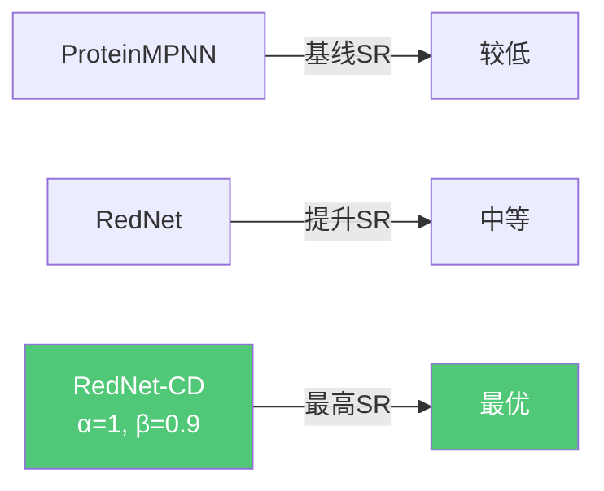

# 03 | RedNet：对比解码设计选择性蛋白质结合子

> **状态**：论文新工作（未单独发表）
> **任务**：固定骨架蛋白质序列设计，重点优化结合选择性

---

## 问题定义

**固定骨架序列设计（Fixed-Backbone Sequence Design）**：给定蛋白质复合物的三维骨架结构，设计结合子（binder）的氨基酸序列，使其：
1. **高亲和力**结合目标靶标（on-target）
2. **高选择性**区分高度相似的非目标靶标（off-target）

### 选择性设计的挑战

```mermaid
graph LR
    A[结合子序列 s] --> B[on-target 复合物<br/>结构 x_on]
    A --> C[off-target 复合物<br/>结构 x_off]
    
    B --> D[高亲和力 ✅]
    C --> E[低亲和力 ✅]
    
    D & E --> F{如何同时优化？}
    
    F --> G[标准序列设计<br/>仅最大化 p(s|x_on)<br/>❌ 忽略off-target]
    F --> H[对比解码<br/>最大化 p(s|x_on)<br/>同时最小化 p(s|x_off)<br/>✅ 显式优化选择性]
```

---

## RedNet 架构

### 整体设计

```mermaid
flowchart TD
    subgraph 输入
        A[蛋白质复合物骨架结构<br/>固定骨架坐标]
    end

    subgraph 多尺度图编码器
        A --> B[残基图 Residue Graph<br/>K-NN图, K=48, 基于Cα距离]
        A --> C[原子图 Atom Graph<br/>半径图, r=15Å, max k=96]
        
        B --> D[GAT层<br/>图注意力网络]
        C --> E[EGAT层<br/>等变图注意力层]
        
        D --> F[全局注意力<br/>带配对偏置的注意力]
        E --> F
        
        F --> G[节点表示 s_i<br/>边表示 p_ij]
    end

    subgraph 因果Transformer解码器
        G --> H[自回归解码<br/>逐位置预测氨基酸]
        H --> I[p(a_t | a_<t, structure)]
    end

    subgraph 对比解码
        I --> J[on-target log-likelihood]
        I --> K[off-target log-likelihood]
        J & K --> L[对比得分<br/>ℓ(a) = 1+α·log p_on - α·log p_off]
        L --> M[候选集过滤<br/>S_t = {a: p_on(a) ≥ β·max p_on}]
        M --> N[温度采样<br/>s_t ~ softmax(ℓ(a)/τ)]
    end

    subgraph 输出
        N --> O[设计序列 s]
    end

    style D fill:#4A90D9,color:#fff
    style E fill:#4A90D9,color:#fff
    style F fill:#7B68EE,color:#fff
    style L fill:#50C878,color:#fff
```

---

## 核心模块详解

### 1. 多尺度图特征

| 特征类型 | 形状 | 描述 |
|---------|------|------|
| **残基图边特征** | | |
| 核心原子对RBF | (N,K,C²D) | 核心原子间距离的径向基函数编码 |
| 核心原子逆距离 | (N,K,C²) | (1+d_ij)⁻¹ |
| 相对残基索引 | (N,K) | 序列位置偏移编码 |
| 同链指示符 | (N,K) | 是否同一条链 |
| 局部坐标系相对位置 | (N,K,3C) | N-Cα-C局部坐标系中的核心原子坐标 |
| Cβ-侧链RBF | (N,K,32D) | 伪Cβ到侧链原子的距离（设计链掩码） |
| **原子图节点特征** | | |
| 原子类型 | (M,A) | 37种原子类型的one-hot编码 |

> 核心原子：N, Cα, C, O, 伪Cβ（共5种）

### 2. GAT层（图注意力网络）

```
# 边消息构建
m_ij = Linear(p_ij) + Gather(W_src·s, E) + W_tgt·s_i
m_ij = MLP(m_ij)

# 全局池化（带门控）
o_global_i = mean_{j∈δ(i)} m_ij
Δs = Linear(Sigmoid(W_g·s_i) ⊙ o_global_i)

# 图注意力（带门控）
α_ij = W_A · LeakyReLU(Linear(m_ij))
α_ij = Softmax_{j∈δ(i)}(α_ij)
o_gat_i = Σ_j α_ij · Linear(m_ij)
Δs += Linear(Sigmoid(W_g'·s_i) ⊙ o_gat_i)

# 残差更新
s = s + Dropout(Δs)
s = s + Dropout(MLP(s))
```

**两种聚合策略的互补性**：
- 全局池化：捕获邻域整体统计信息
- 图注意力：关注最相关的邻居

### 3. 带配对偏置的全局注意力

$$A_{ij} = \frac{Q_i \cdot K_j}{\sqrt{d}} + B_{ij}$$

- $B_{ij} = \text{Linear}(p_{ij})$：配对特征作为注意力偏置
- 捕获长程相互作用（弥补局部图卷积的不足）

### 4. 等变图注意力层（EGAT）

用于原子图，显式处理坐标信息：
```
z_ij = y_j - x_i  # 相对位置向量
d_ij = ||z_ij||₂  # 距离
m_ij = Linear([q_i ∥ k_j ∥ d_ij ∥ e_ij])
```

---

## 对比解码算法

### 核心公式

$$\ell(s_t) = (1+\alpha)\log p(s_t | s_{<t}, r_{on}, x_{on}) - \alpha \log p(s_t | s_{<t}, r_{off}, x_{off})$$

- $\alpha \geq 0$：对比惩罚强度（$\alpha=0$ 退化为标准解码）
- $r_{on}, r_{off}$：on-target和off-target的靶标序列
- $x_{on}, x_{off}$：对应的结合结构

### 候选集过滤（防止低概率token）

$$S_t = \{s : p(s | s_{<t}, r_{on}, x_{on}) \geq \beta \cdot \max_a p(a | s_{<t}, r_{on}, x_{on})\}$$

- $\beta \in [0,1]$：过滤阈值，确保候选token在on-target下概率足够高
- 最终从 $S_t$ 中按温度 $\tau$ 采样

```mermaid
flowchart LR
    A[位置 t] --> B[计算 on-target 概率分布]
    A --> C[计算 off-target 概率分布]
    B --> D[过滤候选集 S_t<br/>保留高概率token]
    B & C --> E[计算对比得分 ℓ(a)]
    D & E --> F[在 S_t 内按 ℓ(a)/τ 采样]
    F --> G[选定氨基酸 s_t]
```

### 与亲和力预测的联系

结合自由能近似：
$$\Delta G \approx \log p(s, r | x_{bound}) - \log p(s | x_{binder}) - \log p(r | x_{target})$$

对比解码中的off-target上下文等价于最小化 $\Delta G_{off}$，即降低对非目标靶标的结合亲和力。

---

## 评估指标体系

### 序列评分指标

| 指标 | 公式 | 含义 |
|------|------|------|
| `ll` | 结合子序列平均log-likelihood | 序列-结构兼容性 |
| `ll_global` | 全复合物序列平均log-likelihood | 整体兼容性 |
| `ll_mt` | 仅突变位置的log-likelihood | 突变效果 |
| `ll_ref` | 突变位置相对野生型的log-likelihood差 | 突变改善程度 |
| `ll_cd` | 对比log-likelihood | 选择性评分 |
| `ll_cd_ref` | 对比参考归一化评分 | 综合选择性 |

### 结构评估指标（AlphaFold3 cofolding）

- **pTM**：预测TM-score（>0.55为成功）
- **ipTM**：界面预测TM-score（>0.5为成功）
- **Dsn pLDDT**：设计链预测LDDT（>80为成功）
- **成功率（SR）**：三个条件同时满足的比例

---

## 实验结果

### 序列恢复率（Native Sequence Recovery）

| 模型 | σ | 单体NSR | 同源二聚体NSR | 异源二聚体NSR |
|------|---|--------|------------|------------|
| ESM-IF | 0 | 0.38 | 0.43 | 0.33 |
| PiFold | 0 | 0.40 | 0.45 | 0.35 |
| **RedNet** | **0** | **0.43** | **0.49** | **0.43** |
| ProteinMPNN | 0.02 | 0.36 | 0.42 | 0.37 |
| **RedNet** | **0.02** | 0.37 | 0.43 | **0.39** |

### 零样本结合亲和力预测（SKEMPI v2.0）

- RedNet (σ=0.02) + `cd_ll_ref` 评分：Spearman ρ = **0.28**，Kendall τ = **0.20**
- 优于所有基线方法（ProteinMPNN, ESM-IF, PiFold）
- 噪声增强（σ=0.02 vs σ=0）一致提升性能

### 自洽性（Self-Consistency）结果

在107个异源二聚体目标上（AlphaFold3 cofolding验证）：



### 选择性结果

**Rosetta结合能差值**（on-target - off-target，负值越好）：

| 方法 | 负值比例（差值<0） | 说明 |
|------|----------------|------|
| ProteinMPNN | 基线 | — |
| RedNet | 提升 | 多尺度图改善界面建模 |
| **RedNet-CD** | **最优** | 对比解码显式优化选择性 |

**AlphaFold3 cofolding选择性**：
- 选择性 = on-target ipTM > 0.55 且 off-target ipTM < 0.55 的比例
- RedNet-CD 在选择性指标上优于所有基线

### 界面物理化学性质

RedNet-CD设计的界面具有：
- 更好的形状互补性（Int SC）
- 更低的界面自由能（Int dG）
- 更多的氢键（Int HBonds）
- 更少的不满足氢键（Int dUnsat HB）

---

## 关键洞察

1. **多尺度图的必要性**：原子图捕获侧链信息，对界面设计至关重要；仅用残基图（如ProteinMPNN）会丢失原子级细节
2. **对比解码的优雅性**：无需重新训练模型，在推理阶段通过修改解码目标实现选择性优化，工程上高效实用
3. **噪声增强的作用**：训练时加入骨架坐标噪声（σ=0.02）提升了模型对结合亲和力变化的敏感性
4. **辅助边损失的正则化效果**：边级交叉熵损失防止过拟合，促使模型学习更有信息量的配对表示
5. **α和β的权衡**：α控制选择性强度，β防止选择性过强导致亲和力下降，两者需要平衡


---

## Python 伪代码实现

```python
import torch
import torch.nn as nn
import torch.nn.functional as F
import math

# ─────────────────────────────────────────────
# 1. 图注意力层 GAT（带双路聚合）
# ─────────────────────────────────────────────
class GATLayer(nn.Module):
    """
    RedNet 的图注意力层，包含：
    - 全局池化分支（捕获邻域整体统计）
    - 注意力聚合分支（关注最相关邻居）
    两路结果通过门控机制融合。
    """
    def __init__(self, node_dim, edge_dim, hidden_dim):
        super().__init__()
        # 边消息网络
        self.msg_mlp = nn.Sequential(
            nn.Linear(2 * node_dim + edge_dim, hidden_dim),
            nn.ReLU(),
            nn.Linear(hidden_dim, hidden_dim),
        )
        # 全局池化门控
        self.gate_global = nn.Linear(node_dim, hidden_dim)
        self.proj_global = nn.Linear(hidden_dim, node_dim)
        # 注意力评分
        self.attn_score  = nn.Linear(hidden_dim, 1)
        # 注意力门控
        self.gate_attn   = nn.Linear(node_dim, hidden_dim)
        self.proj_attn   = nn.Linear(hidden_dim, node_dim)
        # 残差 MLP
        self.res_mlp = nn.Sequential(
            nn.Linear(node_dim, node_dim), nn.ReLU(),
            nn.Linear(node_dim, node_dim)
        )
        self.dropout = nn.Dropout(0.1)

    def forward(self, s, p, edge_index, causal_mask=None):
        """
        s          : [N, node_dim]  节点特征
        p          : [E, edge_dim]  边特征
        edge_index : [2, E]         (src, dst)
        causal_mask: [E]            自回归解码时的因果掩码
        """
        src, dst = edge_index

        # 构建边消息
        m = self.msg_mlp(torch.cat([s[src], s[dst], p], dim=-1))  # [E, hidden]
        if causal_mask is not None:
            m = m * causal_mask.unsqueeze(-1)  # 掩盖未来位置

        # ── 分支1：全局均值池化（带门控）──
        agg_global = torch.zeros(s.size(0), m.size(-1), device=s.device)
        count = torch.zeros(s.size(0), 1, device=s.device)
        agg_global.scatter_add_(0, dst.unsqueeze(-1).expand_as(m), m)
        count.scatter_add_(0, dst.unsqueeze(0).T, torch.ones(dst.size(0), 1, device=s.device))
        agg_global = agg_global / count.clamp(min=1)
        gate_g = torch.sigmoid(self.gate_global(s))
        delta_s = self.proj_global(gate_g * agg_global)

        # ── 分支2：图注意力（带门控）──
        alpha = self.attn_score(F.leaky_relu(m)).squeeze(-1)  # [E]
        # Softmax over neighbors of each dst node
        alpha = softmax_by_dst(alpha, dst, s.size(0))         # [E]
        agg_attn = torch.zeros(s.size(0), m.size(-1), device=s.device)
        agg_attn.scatter_add_(0, dst.unsqueeze(-1).expand_as(m),
                              alpha.unsqueeze(-1) * m)
        gate_a = torch.sigmoid(self.gate_attn(s))
        delta_s = delta_s + self.proj_attn(gate_a * agg_attn)

        # 残差更新
        s = s + self.dropout(delta_s)
        s = s + self.dropout(self.res_mlp(s))
        return s, p


# ─────────────────────────────────────────────
# 2. 带配对偏置的全局注意力
# ─────────────────────────────────────────────
class PairBiasAttention(nn.Module):
    """
    标准多头注意力 + 配对特征作为注意力偏置，
    捕获残基间的长程相互作用。
    """
    def __init__(self, node_dim, pair_dim, num_heads=8):
        super().__init__()
        self.num_heads = num_heads
        self.head_dim  = node_dim // num_heads
        self.qkv_proj  = nn.Linear(node_dim, 2 * node_dim)   # K, V 共享
        self.q_proj    = nn.Linear(node_dim, node_dim)
        self.bias_proj = nn.Linear(pair_dim, num_heads)       # 配对偏置
        self.out_proj  = nn.Linear(node_dim, node_dim)
        self.gate      = nn.Linear(node_dim, node_dim)

    def forward(self, s, p, attn_mask=None):
        """
        s : [N, node_dim]   节点特征
        p : [N, N, pair_dim] 配对特征（边特征的密集版本）
        """
        N = s.size(0)
        Q = self.q_proj(s).view(N, self.num_heads, self.head_dim)
        KV = self.qkv_proj(s).view(N, 2, self.num_heads, self.head_dim)
        K, V = KV[:, 0], KV[:, 1]

        # 注意力分数 + 配对偏置
        # A[i,j] = Q[i]·K[j] / sqrt(d) + B[i,j]
        attn = torch.einsum('ihd,jhd->ijh', Q, K) / math.sqrt(self.head_dim)
        bias = self.bias_proj(p)                              # [N, N, num_heads]
        attn = attn + bias.permute(2, 0, 1).unsqueeze(0)     # broadcast

        if attn_mask is not None:
            attn = attn.masked_fill(~attn_mask, float('-inf'))

        attn = F.softmax(attn, dim=1)                         # [N, N, num_heads]

        # 聚合 + 门控输出
        out = torch.einsum('ijh,jhd->ihd', attn, V).reshape(N, -1)
        gate = torch.sigmoid(self.gate(s))
        return self.out_proj(gate * out)


# ─────────────────────────────────────────────
# 3. 等变图注意力层 EGAT（用于原子图）
# ─────────────────────────────────────────────
class EGATLayer(nn.Module):
    """
    等变图注意力层：显式处理原子坐标，
    用相对距离和方向向量增强消息传递。
    """
    def __init__(self, node_dim, edge_dim):
        super().__init__()
        self.msg_net   = nn.Linear(2 * node_dim + 1 + edge_dim, node_dim)
        self.attn_net  = nn.Linear(node_dim, 1)
        self.out_proj  = nn.Linear(2 * node_dim, node_dim)

    def forward(self, q, k, x, y, edge_index, e):
        """
        q, k       : [N, node_dim]  查询/键节点特征
        x, y       : [N, 3]         节点坐标（x=查询, y=键）
        edge_index : [2, E]
        e          : [E, edge_dim]  边特征
        """
        src, dst = edge_index
        z   = y[src] - x[dst]                                # 相对位置 [E, 3]
        d   = z.norm(dim=-1, keepdim=True)                   # 距离 [E, 1]

        # 构建消息
        m = self.msg_net(torch.cat([q[dst], k[src], d, e], dim=-1))  # [E, node_dim]

        # 注意力权重
        alpha = self.attn_net(F.leaky_relu(m)).squeeze(-1)   # [E]
        alpha = softmax_by_dst(alpha, dst, q.size(0))

        # 聚合
        agg = torch.zeros(q.size(0), m.size(-1), device=q.device)
        agg.scatter_add_(0, dst.unsqueeze(-1).expand_as(m),
                         alpha.unsqueeze(-1) * m)

        out = self.out_proj(torch.cat([q, agg], dim=-1))
        return out


# ─────────────────────────────────────────────
# 4. RedNet 编码器
# ─────────────────────────────────────────────
class RedNetEncoder(nn.Module):
    """
    多尺度图 Transformer 编码器：
    残基图（GAT + 全局注意力）+ 原子图（EGAT）
    """
    def __init__(self, node_dim=128, pair_dim=64, num_layers=6):
        super().__init__()
        self.residue_layers = nn.ModuleList([
            GATLayer(node_dim, pair_dim, 256) for _ in range(num_layers)
        ])
        self.global_attn_layers = nn.ModuleList([
            PairBiasAttention(node_dim, pair_dim) for _ in range(num_layers)
        ])
        self.atom_layers = nn.ModuleList([
            EGATLayer(node_dim // 2, 16) for _ in range(num_layers)
        ])
        # 将原子特征池化后融合到残基特征
        self.atom_to_residue = nn.Linear(node_dim // 2, node_dim)
        # 辅助边级损失的预测头（正则化用）
        self.edge_head = nn.Linear(pair_dim, 33 * 33)  # 33种氨基酸类型的配对分布

    def forward(self, residue_graph, atom_graph):
        s = residue_graph.x       # [N_res, node_dim]
        p = residue_graph.edge_attr  # [E_res, pair_dim]

        for gat, global_attn, egat in zip(
            self.residue_layers, self.global_attn_layers, self.atom_layers
        ):
            # 残基图：局部 GAT
            s, p = gat(s, p, residue_graph.edge_index)
            # 残基图：全局注意力（长程）
            p_dense = to_dense_pair(p, residue_graph.edge_index, s.size(0))
            s = s + global_attn(s, p_dense)
            # 原子图：等变注意力
            h_atom = egat(atom_graph.x, atom_graph.x,
                          atom_graph.pos, atom_graph.pos,
                          atom_graph.edge_index, atom_graph.edge_attr)
            # 原子特征池化到残基级别并融合
            h_atom_res = scatter_mean(h_atom, atom_graph.residue_id, dim=0)
            s = s + self.atom_to_residue(h_atom_res)

        # 辅助边损失（训练时使用）
        edge_logits = self.edge_head(p)  # [E, 33*33]
        return s, p, edge_logits


# ─────────────────────────────────────────────
# 5. 对比解码算法
# ─────────────────────────────────────────────
class RedNetDecoder(nn.Module):
    """因果 Transformer 解码器，自回归预测氨基酸序列。"""
    def __init__(self, node_dim=128, vocab_size=33, num_layers=3):
        super().__init__()
        self.embed = nn.Embedding(vocab_size + 1, node_dim)  # +1 for MASK token
        decoder_layer = nn.TransformerDecoderLayer(
            d_model=node_dim, nhead=8, batch_first=True
        )
        self.transformer = nn.TransformerDecoder(decoder_layer, num_layers)
        self.output_head = nn.Linear(node_dim, vocab_size)

    def forward(self, partial_seq, encoder_memory, causal_mask):
        """
        partial_seq    : [B, t]       已解码的序列（token ids）
        encoder_memory : [B, N, dim]  编码器输出
        causal_mask    : [t, t]       上三角因果掩码
        """
        x = self.embed(partial_seq)
        x = self.transformer(x, encoder_memory, tgt_mask=causal_mask)
        return self.output_head(x)  # [B, t, vocab_size]


@torch.no_grad()
def contrastive_decode(
    encoder: RedNetEncoder,
    decoder: RedNetDecoder,
    on_target_graph,
    off_target_graph,
    binder_length: int,
    alpha: float = 1.0,   # 对比惩罚强度
    beta:  float = 0.9,   # 候选集过滤阈值
    temperature: float = 0.001,
    vocab_size: int = 33
):
    """
    对比解码：自回归生成结合子序列，
    最大化 on-target log-likelihood，同时惩罚 off-target log-likelihood。

    alpha : 越大选择性越强，但可能牺牲亲和力
    beta  : 越小候选集越宽松，越大越保守
    """
    # 编码两个复合物结构
    mem_on,  _, _ = encoder(on_target_graph.residue,  on_target_graph.atom)
    mem_off, _, _ = encoder(off_target_graph.residue, off_target_graph.atom)

    # 初始化：全 MASK token
    MASK_ID = vocab_size
    seq = torch.full((1, binder_length), MASK_ID, dtype=torch.long)

    for t in range(binder_length):
        # 构建因果掩码（只能看到已解码的位置）
        causal_mask = torch.triu(
            torch.ones(t + 1, t + 1, dtype=torch.bool), diagonal=1
        )

        # 计算 on-target 和 off-target 的 logits
        logits_on  = decoder(seq[:, :t+1], mem_on,  causal_mask)[:, -1]  # [1, V]
        logits_off = decoder(seq[:, :t+1], mem_off, causal_mask)[:, -1]  # [1, V]

        log_p_on  = F.log_softmax(logits_on,  dim=-1)  # [1, V]
        log_p_off = F.log_softmax(logits_off, dim=-1)  # [1, V]

        # 对比得分：ℓ(a) = (1+α)·log p_on(a) - α·log p_off(a)
        contrastive_score = (1 + alpha) * log_p_on - alpha * log_p_off  # [1, V]

        # 候选集过滤：只保留 on-target 概率 ≥ β × max 的 token
        p_on = log_p_on.exp()
        p_max = p_on.max(dim=-1, keepdim=True).values
        valid_mask = p_on >= beta * p_max                                 # [1, V]

        # 将不合法 token 的得分设为 -inf
        contrastive_score = contrastive_score.masked_fill(~valid_mask, float('-inf'))

        # 温度采样
        probs = F.softmax(contrastive_score / temperature, dim=-1)
        next_token = torch.multinomial(probs, num_samples=1)              # [1, 1]
        seq[:, t] = next_token.squeeze(-1)

    return seq  # [1, binder_length]


# ─────────────────────────────────────────────
# 6. 训练（含辅助边损失）
# ─────────────────────────────────────────────
def train_rednet(encoder, decoder, dataloader, optimizer):
    """
    主损失：序列恢复交叉熵
    辅助损失：边级配对分布交叉熵（防止过拟合）
    """
    encoder.train(); decoder.train()
    for batch in dataloader:
        # 编码
        node_feat, _, edge_logits = encoder(
            batch.residue_graph, batch.atom_graph
        )
        # 解码（teacher forcing）
        causal_mask = torch.triu(
            torch.ones(batch.seq_len, batch.seq_len, dtype=torch.bool), diagonal=1
        )
        logits = decoder(batch.input_seq, node_feat.unsqueeze(0), causal_mask)

        # 主损失：序列恢复
        loss_seq = F.cross_entropy(
            logits.view(-1, 33),
            batch.target_seq.view(-1),
            ignore_index=-1
        )
        # 辅助损失：边级配对分布
        loss_edge = F.cross_entropy(
            edge_logits.view(-1, 33 * 33),
            batch.edge_pair_labels.view(-1)
        )

        loss = loss_seq + 0.1 * loss_edge
        optimizer.zero_grad()
        loss.backward()
        optimizer.step()
```
