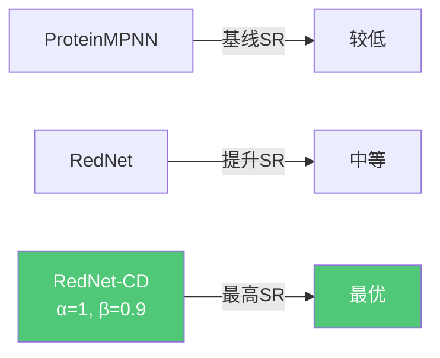

# 03 | RedNet：对比解码设计选择性蛋白质结合子

> **状态**：论文新工作（未单独发表）
> **任务**：固定骨架蛋白质序列设计，重点优化结合选择性

---

## 问题定义

**固定骨架序列设计（Fixed-Backbone Sequence Design）**：给定蛋白质复合物的三维骨架结构，设计结合子（binder）的氨基酸序列，使其：
1. **高亲和力**结合目标靶标（on-target）
2. **高选择性**区分高度相似的非目标靶标（off-target）

### 选择性设计的挑战

```mermaid
graph LR
    A[结合子序列 s] --> B[on-target 复合物<br/>结构 x_on]
    A --> C[off-target 复合物<br/>结构 x_off]
    
    B --> D[高亲和力 ✅]
    C --> E[低亲和力 ✅]
    
    D & E --> F{如何同时优化？}
    
    F --> G[标准序列设计<br/>仅最大化 p(s|x_on)<br/>❌ 忽略off-target]
    F --> H[对比解码<br/>最大化 p(s|x_on)<br/>同时最小化 p(s|x_off)<br/>✅ 显式优化选择性]
```

---

## RedNet 架构

### 整体设计

```mermaid
flowchart TD
    subgraph 输入
        A[蛋白质复合物骨架结构<br/>固定骨架坐标]
    end

    subgraph 多尺度图编码器
        A --> B[残基图 Residue Graph<br/>K-NN图, K=48, 基于Cα距离]
        A --> C[原子图 Atom Graph<br/>半径图, r=15Å, max k=96]
        
        B --> D[GAT层<br/>图注意力网络]
        C --> E[EGAT层<br/>等变图注意力层]
        
        D --> F[全局注意力<br/>带配对偏置的注意力]
        E --> F
        
        F --> G[节点表示 s_i<br/>边表示 p_ij]
    end

    subgraph 因果Transformer解码器
        G --> H[自回归解码<br/>逐位置预测氨基酸]
        H --> I[p(a_t | a_<t, structure)]
    end

    subgraph 对比解码
        I --> J[on-target log-likelihood]
        I --> K[off-target log-likelihood]
        J & K --> L[对比得分<br/>ℓ(a) = 1+α·log p_on - α·log p_off]
        L --> M[候选集过滤<br/>S_t = {a: p_on(a) ≥ β·max p_on}]
        M --> N[温度采样<br/>s_t ~ softmax(ℓ(a)/τ)]
    end

    subgraph 输出
        N --> O[设计序列 s]
    end

    style D fill:#4A90D9,color:#fff
    style E fill:#4A90D9,color:#fff
    style F fill:#7B68EE,color:#fff
    style L fill:#50C878,color:#fff
```

---

## 核心模块详解

### 1. 多尺度图特征

| 特征类型 | 形状 | 描述 |
|---------|------|------|
| **残基图边特征** | | |
| 核心原子对RBF | (N,K,C²D) | 核心原子间距离的径向基函数编码 |
| 核心原子逆距离 | (N,K,C²) | (1+d_ij)⁻¹ |
| 相对残基索引 | (N,K) | 序列位置偏移编码 |
| 同链指示符 | (N,K) | 是否同一条链 |
| 局部坐标系相对位置 | (N,K,3C) | N-Cα-C局部坐标系中的核心原子坐标 |
| Cβ-侧链RBF | (N,K,32D) | 伪Cβ到侧链原子的距离（设计链掩码） |
| **原子图节点特征** | | |
| 原子类型 | (M,A) | 37种原子类型的one-hot编码 |

> 核心原子：N, Cα, C, O, 伪Cβ（共5种）

### 2. GAT层（图注意力网络）

```
# 边消息构建
m_ij = Linear(p_ij) + Gather(W_src·s, E) + W_tgt·s_i
m_ij = MLP(m_ij)

# 全局池化（带门控）
o_global_i = mean_{j∈δ(i)} m_ij
Δs = Linear(Sigmoid(W_g·s_i) ⊙ o_global_i)

# 图注意力（带门控）
α_ij = W_A · LeakyReLU(Linear(m_ij))
α_ij = Softmax_{j∈δ(i)}(α_ij)
o_gat_i = Σ_j α_ij · Linear(m_ij)
Δs += Linear(Sigmoid(W_g'·s_i) ⊙ o_gat_i)

# 残差更新
s = s + Dropout(Δs)
s = s + Dropout(MLP(s))
```

**两种聚合策略的互补性**：
- 全局池化：捕获邻域整体统计信息
- 图注意力：关注最相关的邻居

### 3. 带配对偏置的全局注意力

$$A_{ij} = \frac{Q_i \cdot K_j}{\sqrt{d}} + B_{ij}$$

- $B_{ij} = \text{Linear}(p_{ij})$：配对特征作为注意力偏置
- 捕获长程相互作用（弥补局部图卷积的不足）

### 4. 等变图注意力层（EGAT）

用于原子图，显式处理坐标信息：
```
z_ij = y_j - x_i  # 相对位置向量
d_ij = ||z_ij||₂  # 距离
m_ij = Linear([q_i ∥ k_j ∥ d_ij ∥ e_ij])
```

---

## 对比解码算法

### 核心公式

$$\ell(s_t) = (1+\alpha)\log p(s_t | s_{<t}, r_{on}, x_{on}) - \alpha \log p(s_t | s_{<t}, r_{off}, x_{off})$$

- $\alpha \geq 0$：对比惩罚强度（$\alpha=0$ 退化为标准解码）
- $r_{on}, r_{off}$：on-target和off-target的靶标序列
- $x_{on}, x_{off}$：对应的结合结构

### 候选集过滤（防止低概率token）

$$S_t = \{s : p(s | s_{<t}, r_{on}, x_{on}) \geq \beta \cdot \max_a p(a | s_{<t}, r_{on}, x_{on})\}$$

- $\beta \in [0,1]$：过滤阈值，确保候选token在on-target下概率足够高
- 最终从 $S_t$ 中按温度 $\tau$ 采样

```mermaid
flowchart LR
    A[位置 t] --> B[计算 on-target 概率分布]
    A --> C[计算 off-target 概率分布]
    B --> D[过滤候选集 S_t<br/>保留高概率token]
    B & C --> E[计算对比得分 ℓ(a)]
    D & E --> F[在 S_t 内按 ℓ(a)/τ 采样]
    F --> G[选定氨基酸 s_t]
```

### 与亲和力预测的联系

结合自由能近似：
$$\Delta G \approx \log p(s, r | x_{bound}) - \log p(s | x_{binder}) - \log p(r | x_{target})$$

对比解码中的off-target上下文等价于最小化 $\Delta G_{off}$，即降低对非目标靶标的结合亲和力。

---

## 评估指标体系

### 序列评分指标

| 指标 | 公式 | 含义 |
|------|------|------|
| `ll` | 结合子序列平均log-likelihood | 序列-结构兼容性 |
| `ll_global` | 全复合物序列平均log-likelihood | 整体兼容性 |
| `ll_mt` | 仅突变位置的log-likelihood | 突变效果 |
| `ll_ref` | 突变位置相对野生型的log-likelihood差 | 突变改善程度 |
| `ll_cd` | 对比log-likelihood | 选择性评分 |
| `ll_cd_ref` | 对比参考归一化评分 | 综合选择性 |

### 结构评估指标（AlphaFold3 cofolding）

- **pTM**：预测TM-score（>0.55为成功）
- **ipTM**：界面预测TM-score（>0.5为成功）
- **Dsn pLDDT**：设计链预测LDDT（>80为成功）
- **成功率（SR）**：三个条件同时满足的比例

---

## 实验结果

### 序列恢复率（Native Sequence Recovery）

| 模型 | σ | 单体NSR | 同源二聚体NSR | 异源二聚体NSR |
|------|---|--------|------------|------------|
| ESM-IF | 0 | 0.38 | 0.43 | 0.33 |
| PiFold | 0 | 0.40 | 0.45 | 0.35 |
| **RedNet** | **0** | **0.43** | **0.49** | **0.43** |
| ProteinMPNN | 0.02 | 0.36 | 0.42 | 0.37 |
| **RedNet** | **0.02** | 0.37 | 0.43 | **0.39** |

### 零样本结合亲和力预测（SKEMPI v2.0）

- RedNet (σ=0.02) + `cd_ll_ref` 评分：Spearman ρ = **0.28**，Kendall τ = **0.20**
- 优于所有基线方法（ProteinMPNN, ESM-IF, PiFold）
- 噪声增强（σ=0.02 vs σ=0）一致提升性能

### 自洽性（Self-Consistency）结果

在107个异源二聚体目标上（AlphaFold3 cofolding验证）：



### 选择性结果

**Rosetta结合能差值**（on-target - off-target，负值越好）：

| 方法 | 负值比例（差值<0） | 说明 |
|------|----------------|------|
| ProteinMPNN | 基线 | — |
| RedNet | 提升 | 多尺度图改善界面建模 |
| **RedNet-CD** | **最优** | 对比解码显式优化选择性 |

**AlphaFold3 cofolding选择性**：
- 选择性 = on-target ipTM > 0.55 且 off-target ipTM < 0.55 的比例
- RedNet-CD 在选择性指标上优于所有基线

### 界面物理化学性质

RedNet-CD设计的界面具有：
- 更好的形状互补性（Int SC）
- 更低的界面自由能（Int dG）
- 更多的氢键（Int HBonds）
- 更少的不满足氢键（Int dUnsat HB）

---

## 关键洞察

1. **多尺度图的必要性**：原子图捕获侧链信息，对界面设计至关重要；仅用残基图（如ProteinMPNN）会丢失原子级细节
2. **对比解码的优雅性**：无需重新训练模型，在推理阶段通过修改解码目标实现选择性优化，工程上高效实用
3. **噪声增强的作用**：训练时加入骨架坐标噪声（σ=0.02）提升了模型对结合亲和力变化的敏感性
4. **辅助边损失的正则化效果**：边级交叉熵损失防止过拟合，促使模型学习更有信息量的配对表示
5. **α和β的权衡**：α控制选择性强度，β防止选择性过强导致亲和力下降，两者需要平衡
