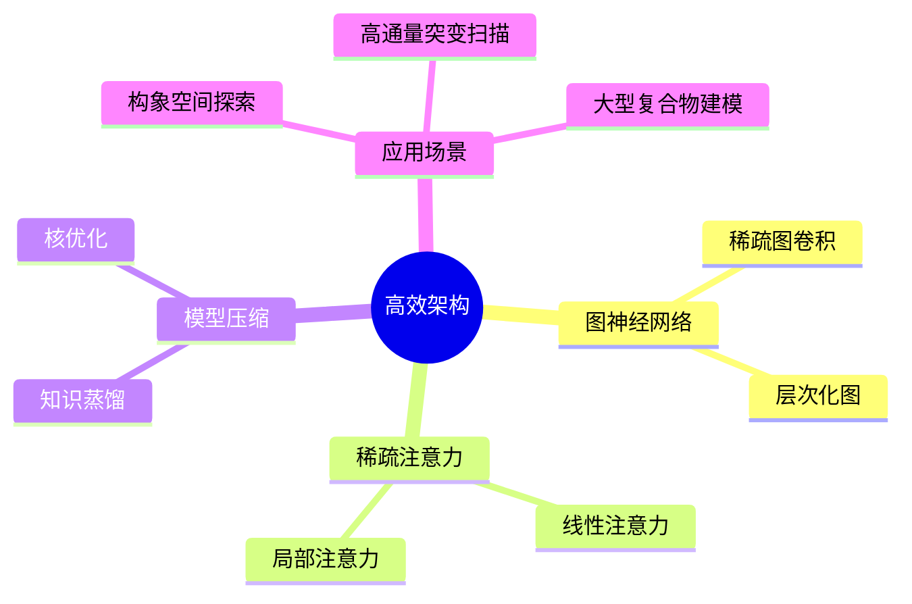
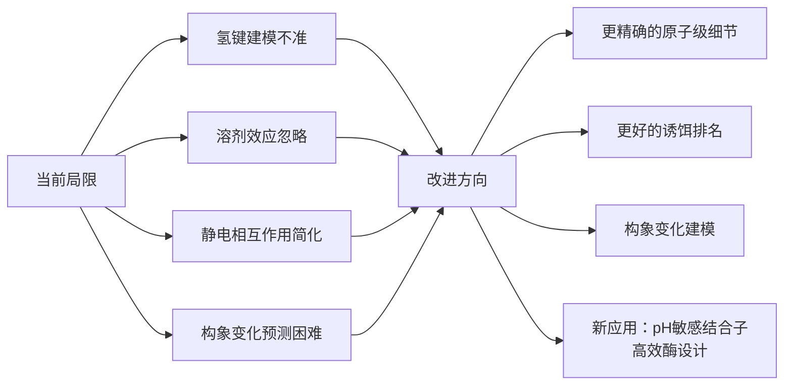
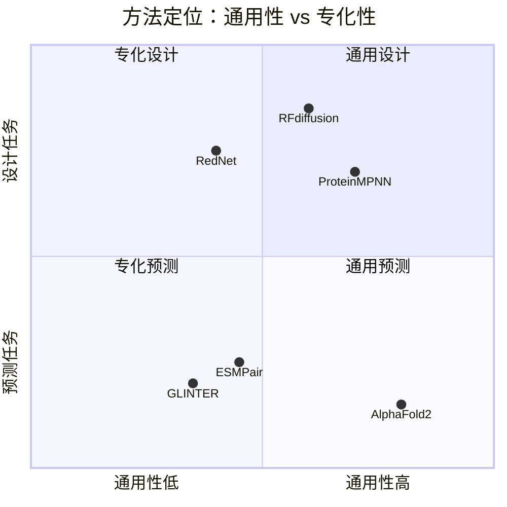

# 04 | 总结与未来方向

---

## 核心贡献回顾

```mermaid
graph TD
    subgraph 本论文的贡献链条
        A[GLINTER<br/>多尺度图 + MSA Transformer<br/>界面接触预测] 
        -->|解决共进化信号质量问题| 
        B[ESMPair<br/>PLM attention驱动配对<br/>异源二聚体结构预测]
        
        A -->|图神经网络框架扩展| C[RedNet<br/>多尺度图Transformer + 对比解码<br/>选择性序列设计]
    end
    
    style A fill:#4A90D9,color:#fff
    style B fill:#7B68EE,color:#fff
    style C fill:#50C878,color:#fff
```

### 三个方法的共同哲学

> **领域特化的深度学习架构** + **原则性搜索/解码策略** = 从结构、进化数据和实验测量中提取互补信息

---

## 未来方向

### 1. 高效架构与稀疏注意力

**问题**：全注意力机制对大型复合物和全原子构象的计算开销极大。



**潜在影响**：
- 更彻底的构象景观探索
- 更高通量的设计候选筛选和突变扫描
- 涉及多个复合物的通路建模

### 2. 多模态数据整合

**问题**：现有模型难以有效整合多种数据模态，且零/少样本泛化能力有限。

| 数据模态 | 当前状态 | 挑战 |
|---------|---------|------|
| 序列/结构比对 | 较好整合 | 多重比对的有效利用 |
| 功能注释 | 部分整合 | 结构化与非结构化注释 |
| 分子动力学轨迹 | 初步探索 | 时间序列建模 |
| 实验测量数据（MAVEs） | 有限整合 | 稀疏、噪声大 |

**RedNet的尝试**：零样本结合亲和力预测（SKEMPI v2.0），展示了向相关任务泛化的潜力，但仍有提升空间。

### 3. 改进蛋白质物理建模

**问题**：现有模型训练目标是恢复原生结构几何，对物理相互作用的建模不够精确。



**关于等变性的讨论**：
- AlphaFold2（使用不变点注意力）和AlphaFold3（完全去除等变性）的消融实验表明等变性对最终性能贡献有限
- 等变性对蛋白质动力学建模是否必要仍是开放问题
- GLINTER和RedNet的重原子表示可自然扩展至全原子结构

### 4. 扩散模型与蛋白质物理

**机遇**：扩散模型与分子动力学有深刻的理论联系，在加速采样和微调方面已有成果。

- 基于RedNet架构的扩散模型（作者正在进行的工作）
- 能量基扩散模型作为统计势能函数

### 5. 端到端蛋白质设计

**当前范式**（三阶段）：
```
骨架生成（RFdiffusion）→ 序列设计（ProteinMPNN/RedNet）→ 结构预测筛选（AF3）
```

**局限**：三个阶段相互独立，无法联合优化。

**未来方向**：
- 从贝叶斯视角统一三个阶段
- RedNet可直接扫描突变，易于扩展至同时预测侧链构象
- 能量基扩散模型可能更通用

### 6. 治疗模态的专化设计

**问题**：不同治疗模态（单克隆抗体、纳米抗体、免疫球蛋白超家族）有不同的工程约束。

**RedNet的扩展潜力**：
- 可微调至特定治疗模态
- 对单克隆抗体和免疫球蛋白超家族的专化设计
- 考虑溶解性、低免疫原性、可制造性等实际约束

---

## 论文的整体贡献定位



本论文的三个方法均处于**领域特化**的位置，通过针对蛋白质复合物问题的专化设计，在各自任务上超越了更通用的方法。这体现了一个重要的研究哲学：**在数据和计算资源有限的情况下，领域知识的注入往往比模型规模的扩大更有效**。

---

## 开放代码与资源

| 方法 | 代码仓库 |
|------|---------|
| GLINTER | https://github.com/zw2x/glinter |
| ESMPair | https://github.com/zw2x/msa_pair |
| RedNet | 论文附录 |
